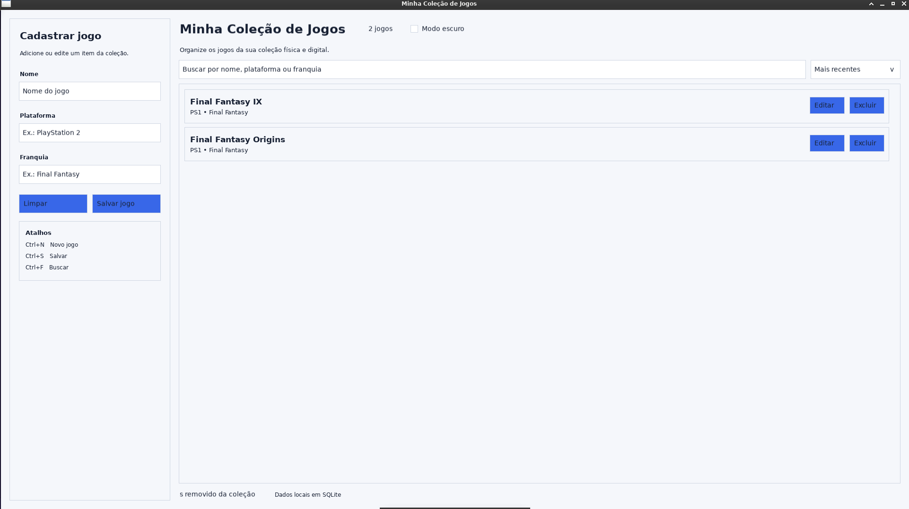

# Minha Coleção de Jogos



Primeiro aplicativo desktop oficial criado com a linguagem Zumbra. Mantém uma biblioteca local de jogos em SQLite, sem conta, telemetria ou dependência de internet.

## Recursos da versão 0.2.9

- cadastro e edição de nome, plataforma, franquia, região, mídia, condição, valor, nota, link, descrição e capa local;
- confirmação antes de excluir;
- busca geral e filtros dedicados por plataforma e franquia;
- ordenação por nome, plataforma, franquia e cadastro recente;
- importação e exportação JSON versionado;
- importação e exportação CSV;
- detecção de duplicatas durante importações;
- backup e restauração SQLite com backup automático de segurança;
- verificação de integridade do banco;
- estatísticas locais com seletor entre barras, pizza e linha, além de tabela;
- menu lateral totalmente ocultável, com reflow responsivo e toggle permanente no header;
- preferências persistentes de tema, ordenação e filtros;
- temas claro e escuro;
- atalhos de teclado, navegação por Tab e modais acessíveis;
- cursor de ponteiro em ações e caret visível nos inputs;
- listas com scroll interno e suporte a nomes longos;
- notificações do sistema com fallback não fatal;
- modal de detalhes compacto, com metadados agrupados e descrição isolada;
- scrollbars da interface de fundo permanecem atrás dos modais;
- execução pela VM e por executável nativo C11.

## Requisitos

- Zumbra 0.12.9 ou superior;
- SQLite 3;
- SDL3 e SDL3_ttf para a interface gráfica.

## Executar

```bash
scripts/run.sh
```

## Testar

```bash
scripts/test.sh
```

A suíte cobre persistência, migrations, JSON, CSV, preferências, modais, acessibilidade, eventos de UI, layout, 500 registros, execução headless pela VM e execução headless do binário nativo.

## Empacotar

```bash
scripts/package-linux.sh
scripts/package-windows.sh
scripts/package-macos.sh
```

Windows e macOS exigem o ambiente nativo correspondente ou uma toolchain de cross-compilation configurada. O Linux foi validado em Debian com `.deb`, AppImage, AppDir e bundle `.tar.gz`.

## Dados locais

O banco é armazenado em `zumbra-game-collection.sqlite`, dentro da pasta de dados do usuário. Preferências ficam na pasta de configuração do usuário. Nenhum dado é enviado para servidores externos.

Consulte [`docs/user-guide.md`](docs/user-guide.md) para importação, exportação, backup e atalhos.

## Manutenção

```bash
scripts/clean.sh
scripts/check-repository-hygiene.sh
```


## Cards e detalhes

Jogos com capa exibem uma miniatura quadrada no lado esquerdo do card. **Ver mais** abre um modal interno com a imagem, todos os metadados, descrição e ações para abrir a imagem ou o link externamente.


## 0.2.8 — native idle CPU fix

This release rebuilds the application on Zumbra 0.12.8. The native C11 runtime now stops non-blocking event drains at the SDL3 poll sentinel, preventing `.deb`, AppImage and native bundle builds from spinning at high CPU while idle.

## 0.2.9 — native rendering performance

This release rebuilds the application on Zumbra 0.12.9. Native `.deb`, AppImage and bundle builds now reuse text textures, cover-image textures and modal blur textures, and avoid repainting the whole window for redundant mouse-motion events. No schema, migration, JSON or CSV changes were introduced.
